# EmotionDetector

## Data Obtention and analysis

This project works with the data found in: [Kaggle](https://www.kaggle.com/datasets/msambare/fer2013). This data includes a train and test folder, each with several images of different facial expressions/emotions.

In order to create a set of validation data, it has been used the DataGeneration.ipynb notebook. In this notebook, the original train set of data has been divided by half in order to have a train and validation set of images. The new training data set folder which will be used throughout the whole project is /data/train1.

An initial analysis of the images has been carried out in order to obtain the amount of images we will be working with and how they are distributed throughout all the classficiation classes (types of emotions). This analysis is shown below:

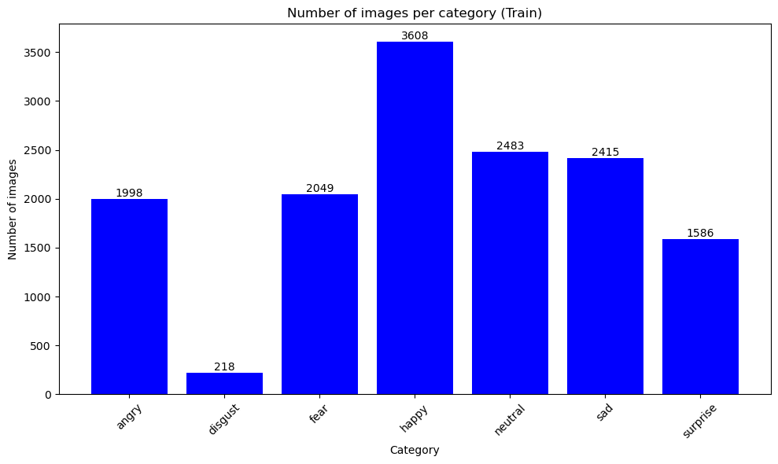

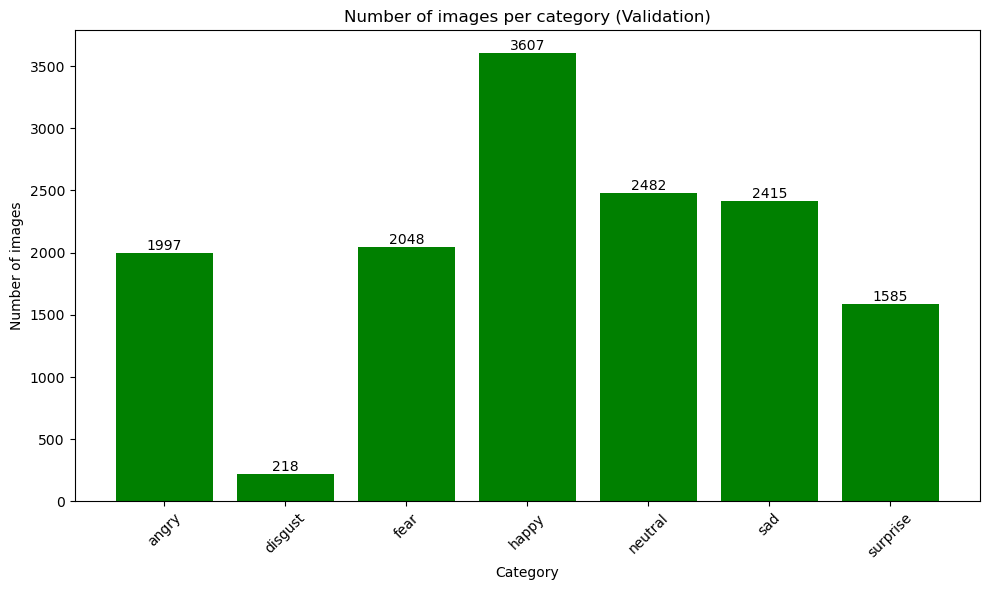

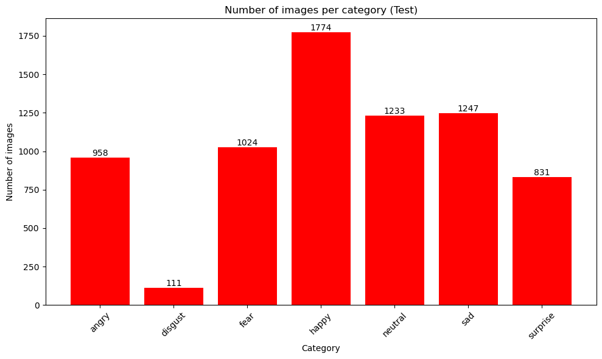

## Search of CNN structure

It has been carried out a search for the optimum cnn structure using keras-tuner (SearchCNNStructure.ipynb). It was found that the best cnn model was the one with the following structure (4 convolutional layers, 3 dense layers and an output dense layer):

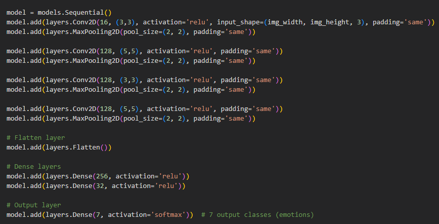

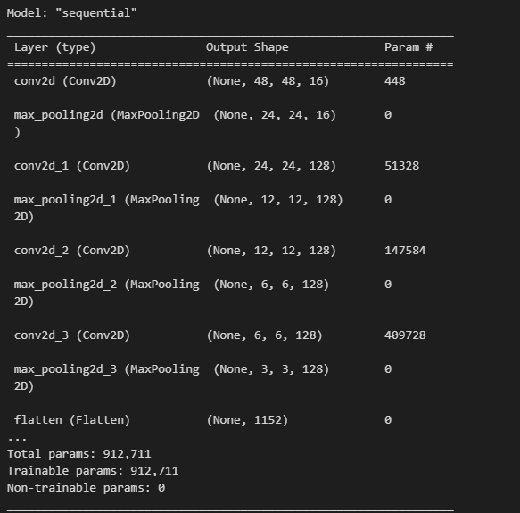

## CNN Assessment and explorations

This initial cnn structure has been assessed with the validation and test data in order to assess its accuracy. Additionally, several other modifications and techniques have been applied to this initial cnn structure in order to study how these changes influence its performance. 

The following techniques and modifications have been performed to the initial cnn structure:

+ Data Augmentation + dropout. By doing so, we will be working with the following cnn structure:

    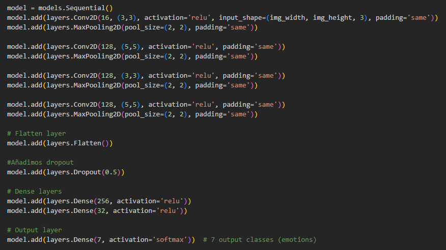

    
    
    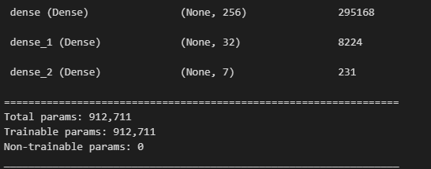
    
    

    
+ Transfer Learning: Using a pre-trained network (VGG16) using feature extraction in two possible ways:
    + Feature extraction 1st way: Running the convolutional base over our dataset, recording its output to a Numpy array on disk. For this part we have used the following cnn densely-connected classfier adjusting the first denses layer's input dimension to the dimensions obtained afetr applying feature extraction to the data:

     
    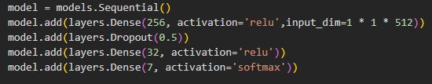

    
    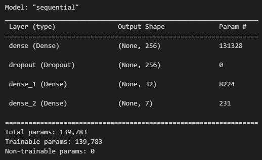
    

    + Feature extraction 2nd way: Extending the model we have (`conv_base`) by adding `Dense` layers on top, and running the whole thing end-to-end on the input data. By doing so, the cnn structure used is as follows:

     
    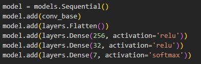

    
    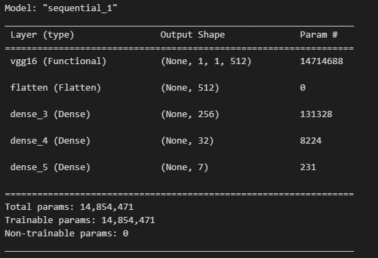
    

## Results

After assessing all techniques the following results are obtained:

|                | Initial CNN structure | Data Augmentation | VGG16 (1st way) | VGG16 (2nd way) |
|----------------|-----------------------|-------------------|-----------------|-----------------|
| Test Accuracy  | 52.7%                 | 56.6%             | 43.9%           | 39.3%           |

## Conclusions

The project explored various techniques and modifications to improve the initial CNN structure's performance. The base model provided low performance so Data Augmentation was used. Even though it provided an accuracy increase, it was still not enough to be considered for a production environment.
Because of this, transfer learning was considered as leveraging an already trained model could improve greatly our current accuracies. First with just running our dataset through the whole model, where the accuracy came as worse than before, and for the second which reduced it further. 
For future study, it could be interesting trying to unfreeze some layers from the VGG16 model to see if it increases the accuracy and surpases the one from our base models.  
